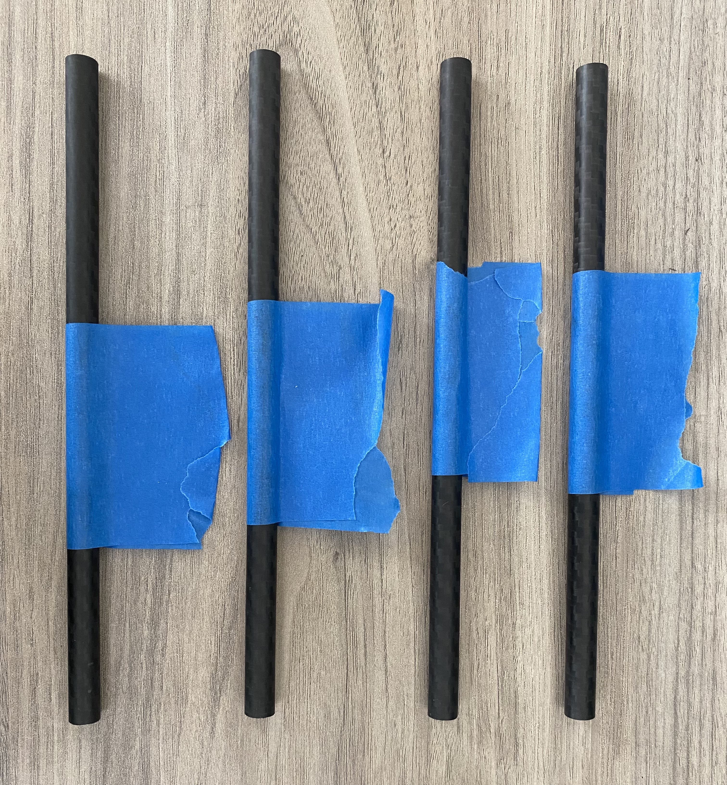
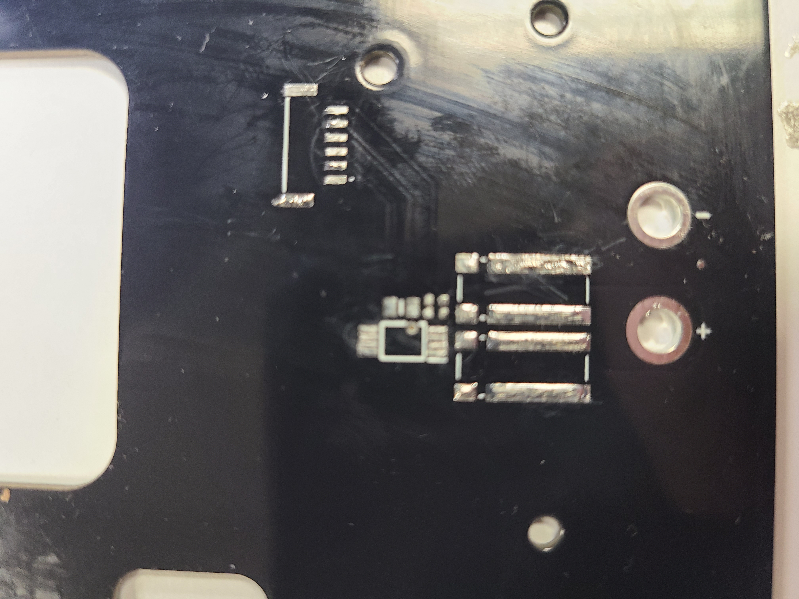
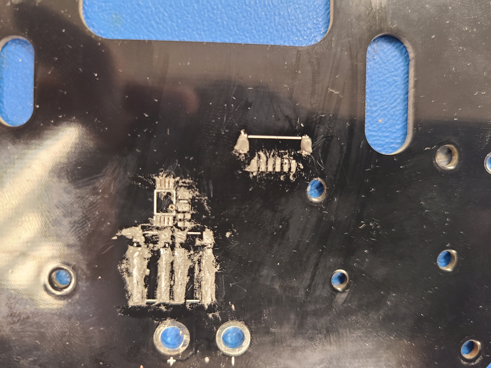
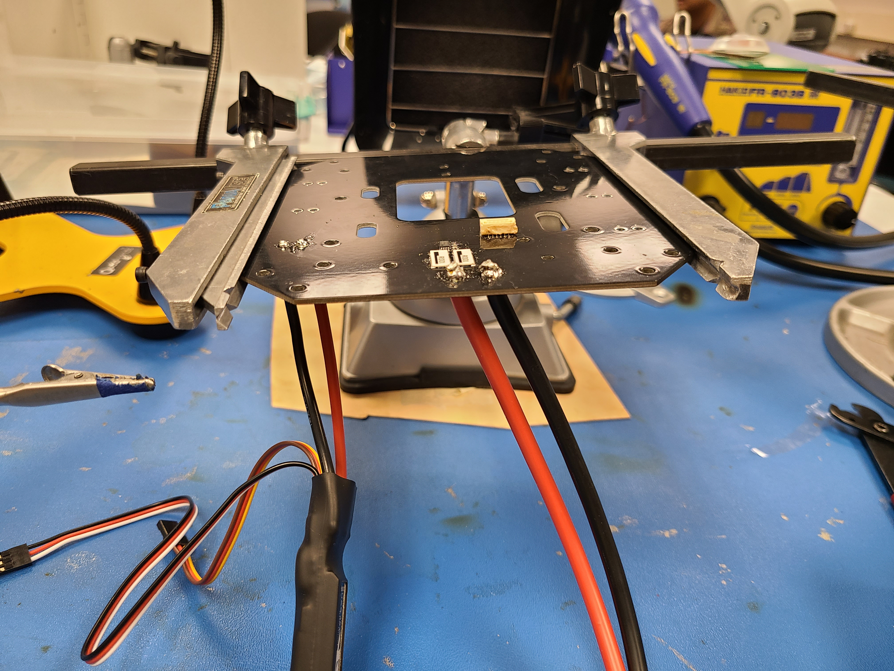
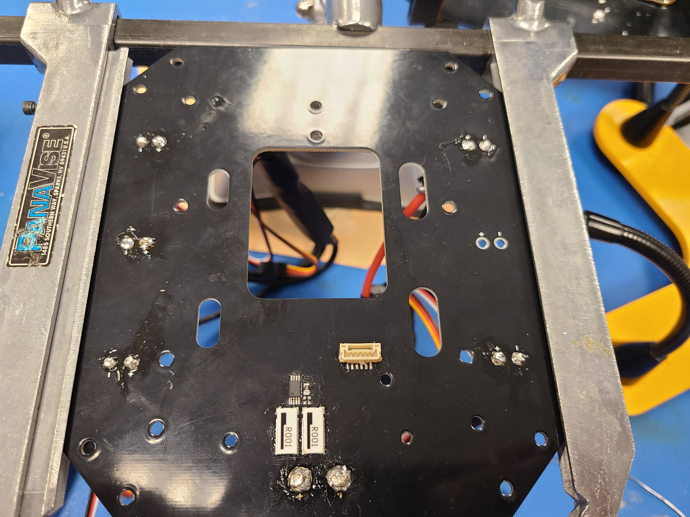

UAV Assembly
====================

Lets build a drone!

.. note::

   This project is under active development.

Overview of Process & Materials
~~~~~~~~~~~~~~~~~~~~~~~~~~~~~~~~~~~~~
TODO: Expand on how to make the drone. If one has access to a 3d printer you can 3d print components or out source to com
oanies like Xometry or SendCutSend. All files are available

The follow page assumes you have all of the required materials. If you haven't bought & manufactured all of the base
go back to TODO: Link page with BOM and instructions for 3d printing and manufacturing

Materials Needed:
List materials need for this page

#. Carbon Fiber Base Plate
    * Water jet or order

#. PCB
    * Solder Components
    * Veifity

#. Arms
    * Print Motor Mounts
    * Print Arm Nodes
    * Print Mold - 1 % scale
    * Cut Tubes to kegnth
    * Insert Threaded Inserts
    * Glue together

#. Landing Legs
    * Print Leg Mounts
    * Print Leg Joint
    * Cut tubes to legnth
    * Drill holes in tubes
    * Bolt Together

Building the UAV Frame
~~~~~~~~~~~~~~~~~~~~~~~~~~~~

Base Plate
''''''''''''''''''

This is the content of the subsubsection.

Arms
''''''''''''''''''

**Required Materials**

* 4 - 120mm Carbon Rods TODO: Double check length
* 4 - Motor Mounts
* 4 - Arm Mounts
* 4 - Arm Molds
* 24 - M3 Heat-set inserts
* JB Weld Plastic Bonder
* Painters Tape

**Gluing Arms Together**

Before gluing, clear your work table. Use either a silicon mat or lay paper towels across your work table as you don't want
to get JB weld ever where. You also want a pair of gloves, a cup to mix the JB weld in and a stiring stick. 

After that grab your carbon rods, arm mounts, motor mounts and molds. Below is a picture of all those components.

.. image:: images/ArmPrepMaterials.jpg
  :width: 400
  :alt: Prep materials for arm gluing

First wrap each of your carbon rods with painters tape in the middle leaving a section that can be used to pull the arm out
of the mold once cured. Below shows rods taped:

Next you'll glue the arms together. Note: the JB weld only has 10 minutes of good working time so if your doing this by yourself
only do two arms at a time to give yourself plenty of time. Now open the JB weld, push out about and 2 quarter size blobs into your container. 
Stir the two parts of the JB thoroughly; after mixing use your stir stick to coat the inside of the motor mount with JB. Then coat the inside 
& outside of the carbon rod. After both the mount and rod had a thin coating slowing insert the rod while spinning it. Make sure there is always 
a thin ring of JB weld around the rod. If there isn't you need more JB. Use a paper towel to remove any excess JB. Repeat the process for the arm
mount. Note: the Motor mount takes more glue then the arm mount. After both sides have been glued rotate the pieces so the tape aligns with the 
top of the motor & arm mount. Slowly insert the glued assembly into the mold. Push firmly to ensure the mounts lay flat within the mold. Repeat the process
for the other 3 arms. Final notes

.. note::

  Don't use too much glue without wiping it away before putting it in the mold or the arm will glue itself to the mold

.. image:: images/GluedArmsinMold.jpg
  :width: 400
  :alt: Glued Arms in Molds

After waiting 24 hours for a full cure before removing the arms from the molds. To remove the arms use the tape to pull the arms out or
insert two rods into the holes in the bottom of the mold while pressing against the mold to pop the arm out of the mold.

**Heat Set Inserts**

Before getting started, go over the following resources on how to use thermoplastic heat set inserts. 

..  youtube:: hwq15qH-4x4
    :width: 100%

Additionally there is a l and make a jig 

https://learn.adafruit.com/heat-set-rig?view=all

Landing Legs
''''''''''''''''''

PCB
''''''''''''''''''
**Required Materials**

* 1 - Custom PCB Drone Frame
* 1 - 0.001 Ohm Current Sense Resistor(SMD)
* 1 - 0402 2 kOhm SMD Resistor(SMD)
* 1 - 0402 8 kOhm SMD Resistor(SMD)
* 1 - 0805 47 kOhm SMD Resistor(SMD)
* 1 - IN9 Voltage to Current Amplifier(SMD)
* 1 - JST-GH Connector
* 4 - KDEDirect KDEXF-UAS35 ESC
* 1 - KDEDirect KDEXF-UBEC22 Battery Eliminator Circuit
* 1 - EC5 Male Battery Connector
* Solder Iron, Solder Paste, Solder Wire, Other Soldering Accessories as Needed
* Tweezers
**The Board Before Beginning**

**Surface Mount Soldering**
\tBegin with a clear workspace, and using the soldering paste with the narrowest needle available, begin to apply the solder to the SMD pads. For the larger pads, 
this is the end of this step, for the very small and close pads, continue reading. Do not worry about solder bridges at this point. Using the tweezers spread
the solder evenly across pads, possibly removing solder to make a very thin layer of paste across all pads. Now we will deal with the solder bridges by using the 
tweezers to carefully scrape between pads, removing the excess solder. 

\tNow we will begin placing the SMD devices. A Pick and Place machine would be preferable for this step because of the small sizes of the devices, but is not
required. Most of the device placements should be relatively simple to figure out by matching pad placements on the device to pads on the board. However because the
2k and 8k resistors are the same size, it is specified that the 8k resistor should go in the spot closer to the largest current sense resistors, while the 2k resistor
should be placed in the spot nearer the center of the board. The assembly drawings are below for reference.

TODO: Add assembly drawings

\tOnce the SMD devices have been placed, use either a reflow oven or a heat gun to cure the solder.

.. image:: images/FinishedSMD.jpg
    :width: 300
  :alt: The Board with Completed SMD Soldering

\tNow that the SMD soldering is finished, we will move to the through-hole soldering. One at a time, solder the four KDEDirect KDEXF-UAS35 ESCs to the four corner ports of
the board. All through-hole wires should emerge from the board from the opposite side that the surface mount devices are. Ensure to place the red wire in the positive terminal. 
Next, solder the singular KDEDirect KDEXF-UBEC22 Battery Eliminator Circuit in a similar fashion to the left middle terminals on the board. Finally, place the JST-GH Connector
into the large terminals near the SMD devices. See the photo for reference.

**Soldering Tips**

* Place as little as possible solder on the board when doing the SMD devices, it is much easier to try again that to remove a device that has solder bridges.
* Turn up the heat on the soldering iron for the thicker through-hole wires. It is difficult to keep them hot enough.
* Take your time, this is a very slow process and there is not a quick way through it.

